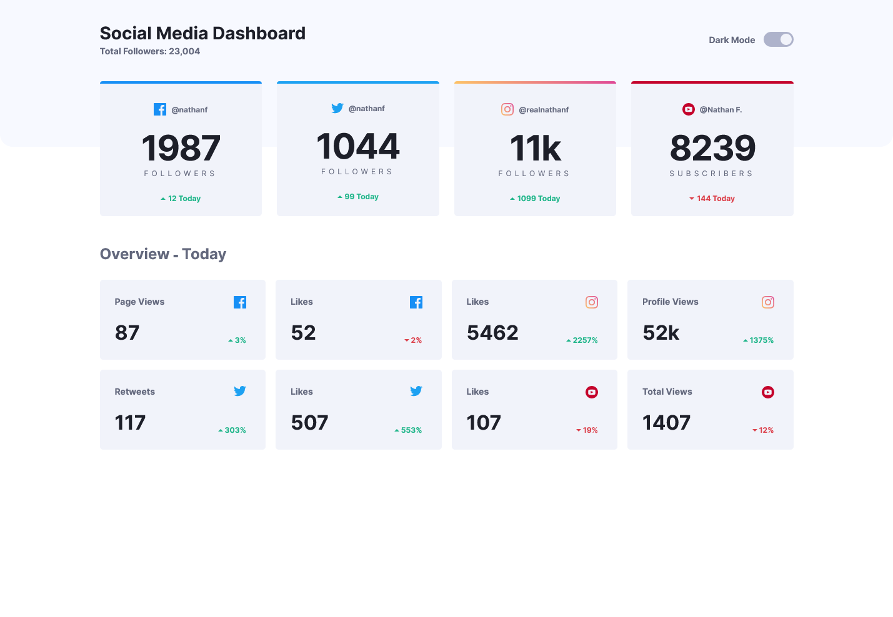

# Frontend Mentor - Social media dashboard with theme switcher solution

This is a solution to the [Social media dashboard with theme switcher challenge on Frontend Mentor](https://www.frontendmentor.io/challenges/social-media-dashboard-with-theme-switcher-6oY8ozp_H). Frontend Mentor challenges help you improve your coding skills by building realistic projects. 

## Table of contents

- [Overview](#overview)
  - [The challenge](#the-challenge)
  - [Screenshot](#screenshot)
  - [Links](#links)
- [My process](#my-process)
  - [Built with](#built-with)
  - [What I learned](#what-i-learned)
  - [Useful resources](#useful-resources)
- [Author](#author)


## Overview

### The challenge

Users should be able to:

- View the optimal layout for the site depending on their device's screen size
- See hover states for all interactive elements on the page
- Toggle color theme to their preference

### Screenshot
- The design is fully responsive but below were the main design points

Mobile Layout - 375px screen width - dark theme


Tablet Layout - 768px screen width - dark theme


Desktop Layout - 1440px screen width - light theme



### Links

- Solution URL: [Add solution URL here](https://your-solution-url.com)
- Live Site URL: [Live](https://mainlycolors.github.io/social-media-dashboard-with-theme-switch/)

## My process

### Built with

- Semantic HTML5 markup
- CSS custom properties
- Flexbox
- CSS Grid
- Mobile-first workflow
- Vanilla JavaScript

### What I learned

Learned how to dynamically switch `:root` CSS properties with JavaScript, all you need to do is use `.style.setProperty('css-variable-name', 'new-value')` on the root element AKA the document. example of what I did shown below, In the CSS I defined the light theme values then use JS to switch them when the toogle switch is clicked.

- Example CSS
```css
:root {
  /* light theme default */
  --clr-font-primary: #1d1f29;
  --clr-font-secondary: #63687d;

  --clr-bg: #fff;
  --clr-bg-banner: #f7f9ff;
  --clr-bg-card: #f1f3fa;
  --clr-bg-card-hover: #e1e4f0;

  --clr-bg-switch: #aeb3cb;
  --clr-bg-switch-hover: linear-gradient(225deg, #40db82 0%, #388fe7 98.02%);
}
```
- Example JavaScript
```js
const root = document.documentElement;
const switchEl = document.querySelector('.theme-switcher-container input');

switchEl.addEventListener('change', function (e) {
  // checked = dark mode
  const checked = switchEl.checked;

  root.style.setProperty('--clr-font-primary', checked ? '#fff' : '#1d1f29');
  root.style.setProperty('--clr-font-secondary', checked ? '#8c98c6' : '#63687d');
  root.style.setProperty('--clr-bg', checked ? '#1d1f29' : '#fff');
  root.style.setProperty('--clr-bg-banner', checked ? '#20222F' : '#f7f9ff');
  root.style.setProperty('--clr-bg-card', checked ? '#252b42' : '#f1f3fa');
  root.style.setProperty('--clr-bg-card-hover', checked ? '#333a55' : '#e1e4f0');
});
```

### Useful resources

- [setPropety MDN](https://developer.mozilla.org/en-US/docs/Web/API/CSSStyleDeclaration/setProperty)

## Author

- Frontend Mentor - [@ryan2505](https://www.frontendmentor.io/profile/yourusername)
- Twitter - [@MainlyColors](https://www.twitter.com/mainlycolors)

